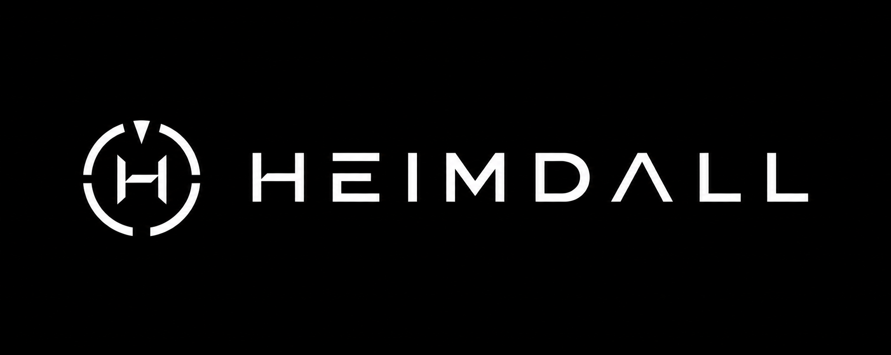
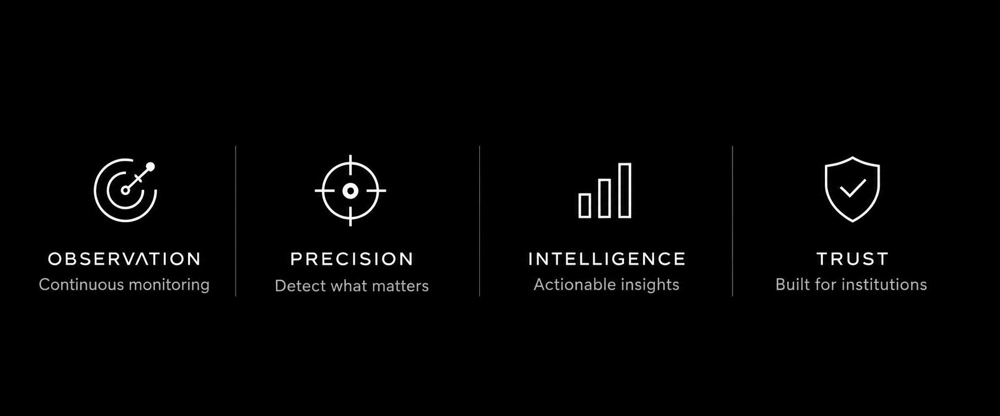
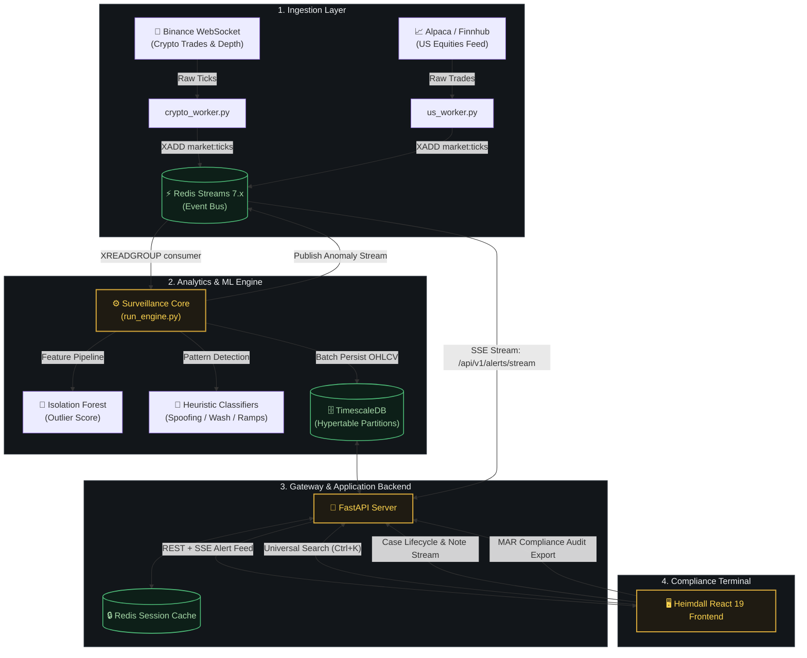

<div align="center">




<a href="#-quick-start">
  
</a>

<br/>

<p align="center">
  <a href="https://fastapi.tiangolo.com"></a>
  <a href="https://react.dev"></a>
  <a href="https://www.typescriptlang.org"></a>
  <a href="https://www.timescale.com"></a>
  <a href="https://redis.io"></a>
  <a href="https://www.tradingview.com"></a>
</p>

<p align="center">
  <a href="https://github.com/prathamkariya/Heimdall/stargazers"></a>
  <a href="https://github.com/prathamkariya/Heimdall/network/members"></a>
  <a href="https://github.com/prathamkariya/Heimdall/commits/main"></a>
  <a href="https://github.com/prathamkariya/Heimdall/issues"></a>
  <a href="LICENSE"></a>
  <a href="#-contributing"></a>
</p>



<p align="center">
  <a href="#-overview"><b>Overview</b></a> •
  <a href="#-architecture--data-pipeline"><b>Architecture</b></a> •
  <a href="#-detection-engine--abuse-heuristics"><b>Detection Engine</b></a> •
  <a href="#-forensic-investigation-workspace"><b>Forensic Workspace</b></a> •
  <a href="#-quick-start"><b>Quick Start</b></a> •
  <a href="#-testing-suite"><b>Testing</b></a>
</p>

</div>

<br/>

## 🌐 Overview

**Heimdall** is an open-source, institutional market surveillance engine and investigative platform engineered for financial exchanges, electronic brokerages, proprietary trading desks, and regulatory compliance teams.

The platform ingests live order-book and transaction telemetry across multi-asset venues (US equities and digital assets), executes statistical outlier scoring and supervised abuse detection models at sub-millisecond latencies, and equips compliance officers with an interactive forensic investigation terminal — named for the Norse watchman who sees all and misses nothing.

<div align="center">

| 👁️ **Observation** | 🎯 **Precision** | 🧠 **Intelligence** | 🔒 **Trust** |
| :---: | :---: | :---: | :---: |
| Multi-venue real-time ingestion | Hybrid ML + rule-based scoring | Explainable, auditable detections | Tamper-evident compliance trail |

</div>

### Comparison Matrix

| Capability | Traditional Surveillance Systems | Heimdall Surveillance Engine |
| :--- | :--- | :--- |
| **Detection Methodology** | Static threshold alerts with high false-positive rates | Hybrid ML (Isolation Forest) + Multi-pattern heuristic scoring |
| **Alert Latency** | Batch processing / End-of-day T+1 reports | Sub-second Server-Sent Events (SSE) streaming |
| **Analyst Terminal** | Clunky legacy desktop / Java applications | Modern high-density React 19 + TradingView Lightweight Charts v5 |
| **Model Transparency** | Black-box proprietary algorithms | Open-source, auditable, and reproducible detection logic |
| **Deployment Model** | Expensive proprietary hardware appliances | Containerized cloud-native architecture (Docker, Compose, K8s) |

---

## 🏗️ Architecture & Data Pipeline

Heimdall decouples stream ingestion, real-time feature extraction, anomaly evaluation, and stateful case management into an event-driven architecture.



### Ingestion & Processing Flow

1. **Market Ingestion** — Dedicated ingestion workers subscribe to external market venues, standardize JSON/binary payloads into unified tick schemas, and write directly to `market:ticks` via Redis Streams.
2. **Feature Extraction** — The engine aggregates incoming ticks into rolling 1-minute, 5-minute, and 15-minute buffers, computing velocity, volatility ratios, bid-ask spread imbalance, and volume z-scores.
3. **Dual Scoring Pipeline**
   - **Unsupervised Anomaly Scoring** — Isolation Forest evaluates high-dimensional feature vectors against historical baselines.
   - **Deterministic Pattern Classifiers** — Rule-based state machines evaluate multi-tick sequences for manipulative market topologies.
4. **Persistence & Telemetry** — OHLCV bars and anomaly records are batched into TimescaleDB hypertables with automated chunk retention.
5. **Real-Time Notification** — Verified alerts are pushed via SSE (`/api/v1/alerts/stream`) to all connected analyst terminals.

<div align="right"><a href="#heimdall">↑ back to top</a></div>

---

## 🧠 Detection Engine & Abuse Heuristics

Heimdall runs a multi-layered detection pipeline evaluating incoming ticks against historical rolling baselines:

| Anomaly Pattern | Detection Criteria & Signal Mechanics | Regulatory Reference |
| :--- | :--- | :--- |
| 🚀 **Pump & Dump** | Volume > 3.5x standard deviation, Price Increase > 4.0%, followed by rapid liquidation runoff within a rolling window. | MAR Art. 12(1)(a) |
| 👻 **Spoofing** | Order book bid/ask imbalance > 0.85 with large order cancellation latency < 800ms prior to execution. | Dodd-Frank Act § 747 |
| 🧊 **Layering** | Submission of multiple fake limit orders at tiered price levels across the book, cancelled before execution. | MiFID II RTS 24 |
| ♻️ **Wash Trading** | Abnormally high turnover volume with statistically negligible net price delta across circular trading patterns. | SEC Rule 10b-5 |
| 💥 **Momentum Ignition** | Aggressive burst of market orders designed to trigger resting stop-loss orders and spark cascade liquidations. | MAR Art. 12(2)(a) |
| 🌲 **Isolation Forest** | Unsupervised partition anomaly scoring on feature vectors: Volume Ratio, Price Delta, Spread, and Order Flow Imbalance. | Unsupervised Baselines |

<div align="right"><a href="#heimdall">↑ back to top</a></div>

---

## 🔬 Forensic Investigation Workspace

When an anomaly triggers or a case is escalated, compliance officers navigate the dedicated **Forensic Workspace**:

<table>
<tr>
<td width="50%" valign="top">

**📈 Interactive Financial Charting**
Built on TradingView Lightweight Charts v5 with custom candlestick series, synchronized volume histograms, and high-contrast anomaly markers.

**🔗 Relational Evidence Linking**
Correlates the anomaly incident window with exact trade executions, tick delta metrics, and order-book depth snapshots.

</td>
<td width="50%" valign="top">

**🧭 Strict Case State Machine**
`OPEN` → `IN_REVIEW` → `ESCALATED` → `RESOLVED` / `DISMISSED`

**🧾 Tamper-Evident Audit Trail**
Every status transition, priority change, and investigation note is recorded with user attribution and UTC timestamps for compliance record-keeping.

</td>
</tr>
</table>

<div align="right"><a href="#heimdall">↑ back to top</a></div>

---

## 🧰 Tech Stack

<div align="center">


| Layer | Technologies |
| :--- | :--- |
| **Ingestion** | Binance WebSocket · Alpaca · Finnhub · Reddit PRAW · Redis Streams |
| **ML / Detection** | scikit-learn Isolation Forest · custom heuristic classifiers · PyRadiomics-style feature pipelines |
| **Backend** | FastAPI · SQLAlchemy 2.0 · Alembic · Pydantic v2 · slowapi rate limiting |
| **Database** | TimescaleDB (PostgreSQL 15 hypertables) |
| **Frontend** | React 19 · TypeScript 5 · Vite · TradingView Lightweight Charts v5 |
| **Testing** | Pytest · Vitest · Playwright · testcontainers |
| **Infra** | Docker Compose · Nginx (TLS + SSE proxying) · GitHub Actions |

</div>

<div align="right"><a href="#heimdall">↑ back to top</a></div>

---

## ⚡ Quick Start

### Prerequisites

- **Docker Engine** 24.0+ & **Docker Compose** v2.20+
- **Node.js** 20.x+ & **npm** 10.x+
- **Python** 3.11+ (for local native development)

<table>
<tr><td>

### 1️⃣ Clone & Configure

```bash
git clone https://github.com/prathamkariya/heimdall.git
cd heimdall

# Initialize environment variables
cp .env.example .env
```

</td></tr>
<tr><td>

### 2️⃣ Start Services with Docker Compose

```bash
# Start TimescaleDB, Redis, FastAPI Backend, and Surveillance Engine
docker-compose up --build -d
```

</td></tr>
<tr><td>

### 3️⃣ Apply Migrations & Seed Demo Data

```bash
# Apply database schema migrations
docker-compose exec api alembic upgrade head

# Seed demo accounts, watchlists, historical OHLCV data, and active investigations
docker-compose exec api python scripts/seed_demo_data.py
```

</td></tr>
<tr><td>

### 4️⃣ Launch Frontend Terminal

```bash
cd heimdall-frontend
npm install
npm run dev
```

📍 Navigate to **`http://localhost:5173`**

</td></tr>
</table>

<div align="right"><a href="#heimdall">↑ back to top</a></div>

---

## 🔑 Demo Credentials

| Role | Username / Email | Password | Access Level |
| :--- | :--- | :--- | :--- |
| 🕵️ **Lead Analyst** | `analyst_1` (`analyst@heimdall.io`) | `Password123!` | Triage anomalies, manage cases, create watchlists, append notes |
| 🛡️ **Compliance Admin** | `admin` (`admin@heimdall.io`) | `AdminPassword123!` | Full audit access, MAR report generation, user access management |


---

## 🧪 Testing Suite

<table>
<tr>
<td width="50%" valign="top">

**Frontend Tests** (Vitest & Playwright)

```bash
cd heimdall-frontend

# Run unit and component tests
npm test

# Verify TypeScript compilation and production build
npm run build

# Run Playwright end-to-end browser automation
npm run test:e2e
```

</td>
<td width="50%" valign="top">

**Backend & ML Tests** (Pytest)

```bash
cd backend

# Run API and integration tests
pytest -v

# Run ML unit tests (Isolation Forest, Forecasts, Calibration)
pytest ml/tests/ -v
```

</td>
</tr>
</table>

<div align="right"><a href="#heimdall">↑ back to top</a></div>

---

## 📂 Repository Structure

<details>
<summary><b>Expand full directory tree (click to open)</b></summary>

```
heimdall/
├── .pics/                          # Official brand assets and design sheets
│   ├── brand_guidelines.png
│   ├── icon_system.png
│   ├── logo_lockup.png
│   ├── pillars_banner.png
│   ├── wordmark.png
│   └── screenshots/                # Product screenshots (see "See It In Action")
├── backend/                        # FastAPI Backend & Surveillance Core
│   ├── alembic/                    # Database migrations (001–005 + Case Management)
│   ├── app/
│   │   ├── core/                   # Security, JWT tokens, database engine configuration
│   │   ├── routers/                # REST endpoints (auth, anomalies, cases, search, reports)
│   │   ├── services/                # Core business logic & anomaly processing services
│   │   ├── models.py                # SQLAlchemy ORM models (TimescaleDB)
│   │   └── schemas.py                # Pydantic v2 schemas
│   ├── ml/                          # Standalone ML package (Isolation Forest, Weak Labeling)
│   │   ├── models/                  # Model architectures
│   │   ├── features/                # Technical indicator & volume feature pipelines
│   │   └── tests/                   # ML test suite
│   ├── scripts/                     # Ingestion workers (crypto, US equity), engine loop, seed scripts
│   └── tests/                       # Pytest backend integration tests
├── heimdall-frontend/               # React 19 + TypeScript Terminal UI
│   ├── public/brand/                # Frontend brand assets
│   ├── src/
│   │   ├── brand/                   # Brand SVG components (Logo, Wordmark, LogoLockup)
│   │   ├── components/              # AnomalyDetail, CaseWorkspace, CommandPalette, LiveEventRow
│   │   ├── layout/                  # Navigation Rail, Header, Shell
│   │   ├── lib/                     # API client, SSE stream hook, formatters
│   │   ├── routes/                  # LiveFeed, Anomalies, Investigations, Watchlists, Audit
│   │   └── theme/                   # Design tokens, color palette, typography definitions
│   ├── package.json
│   └── vite.config.ts
├── docs/                            # Architecture notes & forward-looking roadmaps
├── docker-compose.yml               # Local multi-service orchestration
├── docker-compose.prod.yml          # Production deployment configuration
├── nginx/                           # Nginx reverse proxy & production TLS configs
└── README.md
```

</details>

<div align="right"><a href="#heimdall">↑ back to top</a></div>

---

## 🔒 Security & Regulatory Compliance

- **Zero-Trust Auditability** — Every state mutation is signed with the user ID, timestamped, and stored immutably to meet regulatory chain-of-custody requirements.
- **Deterministic Data Partitioning** — TimescaleDB hypertables are partitioned by symbol and time range to guarantee bounded query times and deterministic retention policies.
- **Session & Credential Security** — Passwords are hashed using bcrypt with salt; authentication uses dual-token JWT rotation (short-lived access tokens with revocable Redis-backed refresh tokens).
- **Regulatory Frameworks Supported**
  - **EU MAR** (Regulation (EU) No 596/2014) — Articles 12 (Market Manipulation) & 16 (Prevention and Detection)
  - **MiFID II** — RTS 24 (Transaction Record Keeping) & RTS 25 (Clock Synchronization)
  - **SEC / FINRA** — Rule 6127 & Section 10(b) / Rule 10b-5


## 🤝 Contributing

Contributions, bug reports, and feature proposals are welcome. Fork the repo, create a feature branch, and open a pull request — please include tests for any behavioral change.

<div align="center">

| [](https://github.com/prathamkariya) |
| :---: |
| [**Pratham Kariya**](https://github.com/prathamkariya) |

</div>

<div align="right"><a href="#heimdall">↑ back to top</a></div>

---

## 📜 License

Distributed under the **MIT License**. See [`LICENSE`](LICENSE) for details.

<br/>


<div align="center"><sub>HEIMDALL // Engineered for Institutional Market Integrity.</sub></div>
