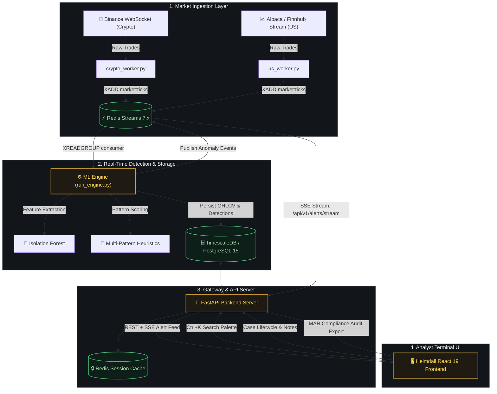

<div align="center">

<p align="center">
  
</p>

### Institutional Market Surveillance & Regulatory Intelligence Platform

[](https://fastapi.tiangolo.com)
[](https://react.dev)
[](https://www.typescriptlang.org)
[](https://www.timescale.com)
[](https://redis.io)
[](https://www.tradingview.com)
[](https://tailwindcss.com)
[](LICENSE)

<p align="center">
  
</p>

<p align="center">
  <b>Sub-second anomaly detection</b> across high-frequency crypto and equity feeds, an institutional <b>forensic investigation workspace</b>, and automated <b>Market Abuse Regulation (MAR / MiFID II)</b> compliance audit trails.
</p>

---

### ⚡ Quick Navigation

[**Platform Overview**](#-platform-overview) •
[**Brand & Visual Identity**](#-brand--visual-identity) •
[**Forensic Investigation Workspace**](#-forensic-investigation-workspace) •
[**Algorithmic Anomaly Engine**](#-algorithmic-anomaly-engine) •
[**Architecture**](#-architecture--data-pipeline) •
[**Quick Start**](#-quick-start) •
[**API Reference**](#-api-endpoints) •
[**Test Suites**](#-testing-suite)

---

</div>

## 🌐 Platform Overview

Heimdall is an institutional market surveillance platform built for high-frequency trading desks, crypto exchanges, and regulatory compliance teams. It continuously ingests trade and order-book feeds, computes statistical and heuristic pattern models in sub-milliseconds, and dispatches actionable alerts directly to a high-performance analyst terminal.

### 💎 Key Capabilities

- **⚡ Real-Time Streaming Ingestion**: Dual-worker pipeline consuming from **Binance WebSocket** (Crypto) and **Alpaca/Finnhub** (US Equities) via **Redis Streams 7.x**.
- **🧠 Hybrid AI Detection Engine**: Merges unsupervised **Isolation Forest** outlier scoring with supervised **Multi-Pattern Heuristics** (Pump & Dump, Spoofing, Wash Trading, Layering, Momentum Ignition).
- **🔬 Deep Investigation Workspace**: Interactive **TradingView Lightweight Charts v5** with synchronized volume histograms, alert markers, evidence pinning, and status progression.
- **⌨️ Global Command Palette (<kbd>Ctrl</kbd>+<kbd>K</kbd>)**: Instant fuzzy search across active investigations, flagged anomalies, market tickers, and quick navigation routes.
- **📋 Regulatory Compliance & Audit Trails**: Tamper-evident, timestamped MAR audit logging tracking every status change, analyst note, and triage action.

---

## 🎨 Brand & Visual Identity

Heimdall's brand identity is anchored by four principles: **Observation**, **Precision**, **Intelligence**, and **Trust**. The visual system is rooted in high-contrast dark surfaces, geometric lines, and financial terminal minimalism.

<p align="center">
  
</p>

### 📐 Geometry & Tokens

- **Icon Architecture**: Segmented outer observation ring (representing 360° radar surveillance) with a top north indicator and geometric `H` core.
- **Color Tokens**:
  - `Near Black` (`#0A0A0A`) — Deep terminal background
  - `Dark Slate` (`#1F2329`) — Structural borders, cards, and dividers
  - `Primary White` (`#FFFFFF`) — High-emphasis data text
  - `Institutional Gold` (`#D4A63A`) — Active alerts, high-confidence anomalies, and key interactions
  - `Slate Gray` (`#687280`) — Metadata, timestamps, and secondary labels
- **Typography Tokens**:
  - **Brand & Headings**: `IBM Plex Sans` (Navigation, Dialogs, Logos, Action Buttons)
  - **Telemetry & Data**: `IBM Plex Mono` (Live feeds, Order books, Candlestick metrics, Timestamps, Hash digests)

<details>
<summary><b>🔍 View Complete Brand Guidelines & Specification Board</b></summary>
<br/>
<p align="center">
  
</p>
</details>

---

## 🔬 Forensic Investigation Workspace

When an anomaly triggers or a case is escalated, investigators enter the dedicated **Forensic Workspace**:

- **Synchronized Candlestick & Volume Charts**: Powered by TradingView Lightweight Charts v5 with custom brand themes (`#0A0A0A` obsidian surface, `#4FBF7A` / `#E8604C` OHLC candles, and institutional gold `#D4A63A` anomaly markers).
- **Relational Evidence Dossier**: Direct inspection of correlated market ticks, multi-pattern score breakdowns, and historical volatility baselines.
- **Lifecycle State Machine**: Strict governance workflow:
  $$\text{OPEN} \longrightarrow \text{IN\_REVIEW} \longrightarrow \text{ESCALATED} \longrightarrow \text{RESOLVED} \mid \text{DISMISSED}$$
- **Analyst Note Stream**: Timestamped, user-attributed investigation logs for multi-analyst handoffs.

---

## 🧠 Algorithmic Anomaly Engine

Heimdall runs a multi-layered detection pipeline evaluating incoming ticks against historical rolling windows:

| Anomaly Pattern | Heuristic Indicators & Detection Criteria | Target Market Behavior |
| :--- | :--- | :--- |
| **🚀 Pump & Dump** | Sudden 3σ volume surge accompanied by sharp price acceleration, followed by rapid liquidation runoff. | Coordinated retail buying or illiquid market ramps |
| **👻 Spoofing** | Placement and rapid cancellation of non-bona fide large orders on bid/ask book to artificially move prices. | Order book manipulation |
| **🥞 Layering** | Submitting multiple fake limit orders at tiered price levels across the book, cancelled prior to execution. | Fake depth illusion |
| **🔄 Wash Trading** | High turnover volume with statistically negligible net price movement (circular wallet or account transactions). | Artificial volume inflation |
| **⚡ Momentum Ignition** | Aggressive series of rapid-fire market orders designed to hit resting stop-loss orders. | Cascading liquidation triggers |
| **🌲 Isolation Forest** | Unsupervised partition anomaly scoring on feature vectors: $(V_{\text{ratio}}, \Delta P_{\text{1m}}, \text{Spread}, \text{OrderFlowImbalance})$. | Novel / complex market anomalies |

---

## 🏗️ Architecture & Data Pipeline



---

## 🚀 Quick Start

### 1. Clone & Configure

```bash
git clone https://github.com/prathamkariya/market-surveillance.git
cd market-surveillance

# Create environment configuration
cp .env.example .env
```

### 2. Launch with Docker Compose

```bash
# Start TimescaleDB, Redis, API, Engine, and Ingestion Workers
docker-compose up --build -d
```

### 3. Run Migrations & Seed Demo Data

```bash
# Run database schema migrations
docker-compose exec api alembic upgrade head

# Seed initial accounts, watchlists, historical candles, and active investigations
docker-compose exec api python scripts/seed_demo_data.py
```

### 4. Launch Frontend Terminal

```bash
cd heimdall-frontend
npm install
npm run dev
```

Navigate to: **`http://localhost:5173`**

---

## 🔑 Pre-Seeded Demo Credentials

| Role | Username / Email | Password | Access Level |
| :--- | :--- | :--- | :--- |
| **Lead Analyst** | `analyst_1` (`analyst@heimdall.io`) | `Password123!` | Case investigations, anomaly triage, custom watchlists |
| **Administrator** | `admin` (`admin@heimdall.io`) | `AdminPassword123!` | System parameters, full MAR compliance audit logs, users |

---

## ⌨️ Command Palette & Keyboard Shortcuts

Press <kbd>Ctrl</kbd> + <kbd>K</kbd> (or <kbd>Cmd</kbd> + <kbd>K</kbd> on macOS) anywhere in the application:

| Shortcut | Action | Scope |
| :--- | :--- | :--- |
| <kbd>Ctrl</kbd> + <kbd>K</kbd> | Open / Close Universal Command Palette | Global |
| <kbd>↑</kbd> / <kbd>↓</kbd> | Navigate search results and case rows | Palette / Tables |
| <kbd>Enter</kbd> | Select item, open case, or execute action | Palette |
| <kbd>Esc</kbd> | Close modal / dismiss inspection drawer | Global |
| <kbd>Tab</kbd> | Switch between Investigation tabs | Workspace |

---

## 📡 API Endpoints

### 🔐 Authentication (`/api/v1/auth`)
- `POST /api/v1/auth/register` — Register a new analyst/admin account
- `POST /api/v1/auth/login` — Exchange credentials for JWT access + refresh tokens
- `POST /api/v1/auth/refresh` — Rotate access token
- `POST /api/v1/auth/logout` — Invalidate refresh token session

### 📊 Market Data & Anomalies (`/api/v1`)
- `GET /api/v1/market-data` — Query OHLCV candle series with symbol & time filters
- `GET /api/v1/anomalies` — Query detected market anomalies with confidence scoring
- `GET /api/v1/alerts/stream` — **Server-Sent Events (SSE)** real-time alert feed

### 📁 Case Management (`/api/v1/cases`)
- `GET /api/v1/cases` — List active investigations with status, priority, and assignee filters
- `POST /api/v1/cases` — Escalate an anomaly into a full investigation dossier
- `GET /api/v1/cases/{id}` — Fetch detailed case record with linked anomalies & notes
- `PATCH /api/v1/cases/{id}` — Update case status (`OPEN`, `IN_REVIEW`, `ESCALATED`, `RESOLVED`, `CLOSED`)
- `POST /api/v1/cases/{id}/notes` — Append an analyst investigation note
- `GET /api/v1/cases/analysts` — List all assignable investigators

### 🔎 Search & Compliance Reports (`/api/v1`)
- `GET /api/v1/search?q={query}` — Unified fuzzy search across cases, tickers, and anomalies
- `GET /api/v1/reports/mar` — Generate Market Abuse Regulation (MAR) audit summaries

---

## 🧪 Testing Suite

### Frontend Tests (Vitest & Playwright)
```bash
cd heimdall-frontend
npm test                 # Run 10 unit & component tests (Vitest)
npm run build            # Verify TypeScript compilation and Vite bundle
npm run test:e2e         # Execute Playwright E2E browser automation
```

### Backend & ML Tests (Pytest)
```bash
cd backend
pytest -v                # Integration & API route tests
pytest ml/tests/ -v      # 300+ ML unit tests (Isolation Forest, ARIMA, LSTM, Calibration)
```

---

## 📂 Repository Structure

```
market-surveillance/
├── .pics/                          # Official brand assets, lockups, icons, and design guidelines
│   ├── brand_guidelines.png
│   ├── icon_system.png
│   ├── logo_lockup.png
│   ├── pillars_banner.png
│   └── wordmark.png
├── backend/                        # FastAPI Backend & Surveillance Services
│   ├── alembic/                    # Database migrations (001–005 + Case Management)
│   ├── app/
│   │   ├── core/                   # Security, JWT tokens, exceptions, database engine
│   │   ├── routers/                # REST endpoints (auth, anomalies, cases, search, reports)
│   │   ├── services/               # Core business & anomaly processing services
│   │   ├── models.py               # SQLAlchemy ORM models (TimescaleDB)
│   │   └── schemas.py              # Pydantic v2 schemas
│   ├── ml/                         # Standalone ML package (Isolation Forest, Weak Labeling, Forecasting)
│   ├── scripts/                    # Ingestion workers (crypto_worker, us_worker), engine loop, seed scripts
│   └── tests/                      # Pytest backend test suite
├── heimdall-frontend/              # React 19 + TypeScript Terminal UI
│   ├── public/brand/               # Frontend brand assets
│   ├── src/
│   │   ├── brand/                  # Brand SVG components (Logo, Wordmark, LogoLockup)
│   │   ├── components/             # AnomalyDetail, CaseWorkspace, CommandPalette, LiveEventRow
│   │   ├── layout/                 # Sidebar Rail, Header, Navigation
│   │   ├── lib/                    # API client, SSE stream connection, formatters
│   │   ├── routes/                 # LiveFeed, Anomalies, Investigations, Watchlists, Audit
│   │   └── theme/                  # Design tokens, color palette, typography definitions
│   ├── package.json
│   └── vite.config.ts
├── docker-compose.yml              # Local multi-service orchestration
├── docker-compose.prod.yml         # Production deployment configuration
├── nginx.conf                      # Reverse proxy & SSE streaming configuration
└── README.md
```

---

## 🛡️ Regulatory Compliance & Disclaimer

Heimdall is engineered to support surveillance mandates under **EU Market Abuse Regulation (MAR - Regulation (EU) No 596/2014)**, **MiFID II**, and **SEC/FINRA Rule 6127**. All audit records, case notes, and anomaly signals are stored with cryptographic integrity for compliance record-keeping.

---

<div align="center">
  <sub>Built with precision for institutional market integrity. Distributed under the MIT License.</sub>
</div>
