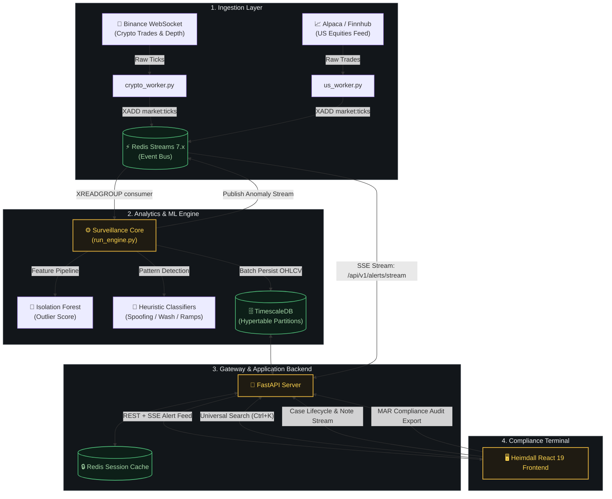

<div align="center">

<p align="center">
  
</p>

<p align="center">
  <strong>Institutional AI Market Surveillance & Regulatory Intelligence Platform</strong><br />
  <em>Real-time anomaly detection, multi-pattern abuse heuristics, forensic investigation workspaces, and automated MAR/MiFID II compliance audit trails.</em>
</p>

<p align="center">
  <a href="https://fastapi.tiangolo.com"></a>
  <a href="https://react.dev"></a>
  <a href="https://www.typescriptlang.org"></a>
  <a href="https://www.timescale.com"></a>
  <a href="https://redis.io"></a>
  <a href="https://www.tradingview.com"></a>
  <a href="LICENSE"></a>
</p>

<p align="center">
  
</p>

<p align="center">
  <a href="#-overview"><b>Overview</b></a> •
  <a href="#-architecture--data-pipeline"><b>Architecture</b></a> •
  <a href="#-detection-engine--abuse-heuristics"><b>Detection Engine</b></a> •
  <a href="#-forensic-investigation-workspace"><b>Forensic Workspace</b></a> •
  <a href="#-quick-start"><b>Quick Start</b></a> •
  <a href="#-api-reference"><b>API Reference</b></a> •
  <a href="#-testing-suite"><b>Testing</b></a>
</p>

---

</div>

## 🌐 Overview

**Heimdall** is an open-source, institutional market surveillance engine and investigative platform engineered for financial exchanges, electronic brokerages, proprietary trading desks, and regulatory compliance teams.

The platform ingests live order-book and transaction telemetry across multi-asset venues (US equities and digital assets), executes statistical outlier scoring and supervised abuse detection models at sub-millisecond latencies, and equips compliance officers with an interactive forensic investigation terminal.

### Comparison Matrix

| Capability | Traditional Surveillance Systems | Heimdall Surveillance Engine |
| :--- | :--- | :--- |
| **Detection Methodology** | Static threshold alerts with high false-positive rates | Hybrid ML (Isolation Forest) + Multi-pattern heuristic scoring |
| **Alert Latency** | Batch processing / End-of-day T+1 reports | Sub-second Server-Sent Events (SSE) streaming |
| **Analyst Terminal** | Clunky legacy desktop / Java applications | Modern high-density React 19 + TradingView Lightweight Charts v5 |
| **Model Transparency** | Black-box proprietary algorithms | Open-source, auditable, and reproducible detection logic |
| **Deployment Model** | Expensive proprietary hardware appliances | Containerized cloud-native architecture (Docker, Compose, K8s) |

---

## 🏗️ Architecture & Data Pipeline

Heimdall decouples stream ingestion, real-time feature extraction, anomaly evaluation, and stateful case management into an event-driven architecture.



### Ingestion & Processing Flow

1. **Market Ingestion**: Dedicated ingestion workers subscribe to external market venues, standardize JSON/binary payloads into unified tick schemas, and write directly to `market:ticks` via Redis Streams.
2. **Feature Extraction**: The engine aggregates incoming ticks into rolling 1-minute, 5-minute, and 15-minute buffers, computing velocity, volatility ratios, bid-ask spread imbalance, and volume z-scores.
3. **Dual Scoring Pipeline**:
   - **Unsupervised Anomaly Scoring**: Isolation Forest evaluates high-dimensional feature vectors against historical baselines.
   - **Deterministic Pattern Classifiers**: Rule-based state machines evaluate multi-tick sequences for manipulative market topologies.
4. **Persistence & Telemetry**: OHLCV bars and anomaly records are batched into TimescaleDB hypertables with automated chunk retention.
5. **Real-Time Notification**: Verified alerts are pushed via SSE (`/api/v1/alerts/stream`) to all connected analyst terminals.

---

## 🧠 Detection Engine & Abuse Heuristics

Heimdall runs a multi-layered detection pipeline evaluating incoming ticks against historical rolling baselines:

| Anomaly Pattern | Detection Criteria & Signal Mechanics | Regulatory Reference |
| :--- | :--- | :--- |
| **Pump & Dump** | Volume > 3.5x standard deviation, Price Increase > 4.0%, followed by rapid liquidation runoff within a rolling window. | MAR Art. 12(1)(a) |
| **Spoofing** | Order book bid/ask imbalance > 0.85 with large order cancellation latency < 800ms prior to execution. | Dodd-Frank Act § 747 |
| **Layering** | Submission of multiple fake limit orders at tiered price levels across the book, cancelled before execution. | MiFID II RTS 24 |
| **Wash Trading** | Abnormally high turnover volume with statistically negligible net price delta across circular trading patterns. | SEC Rule 10b-5 |
| **Momentum Ignition** | Aggressive burst of market orders designed to trigger resting stop-loss orders and spark cascade liquidations. | MAR Art. 12(2)(a) |
| **Isolation Forest** | Unsupervised partition anomaly scoring on feature vectors: Volume Ratio, Price Delta, Spread, and Order Flow Imbalance. | Unsupervised Baselines |

---

## 🔬 Forensic Investigation Workspace

When an anomaly triggers or a case is escalated, compliance officers navigate the dedicated **Forensic Workspace**:

- **Interactive Financial Charting**: Built on TradingView Lightweight Charts v5 with custom candlestick series, synchronized volume histograms, and high-contrast anomaly markers.
- **Relational Evidence Linking**: Correlates the anomaly incident window with exact trade executions, tick delta metrics, and order-book depth snapshots.
- **Strict Case State Machine**: `OPEN` → `IN_REVIEW` → `ESCALATED` → `RESOLVED` / `DISMISSED`.
- **Tamper-Evident Audit Trail**: Every status transition, priority change, and investigation note is recorded with user attribution and UTC timestamps for compliance record-keeping.

---

## ⚡ Quick Start

### Prerequisites

- **Docker Engine** 24.0+ & **Docker Compose** v2.20+
- **Node.js** 20.x+ & **npm** 10.x+
- **Python** 3.11+ (for local native development)

### 1. Clone & Configure

```bash
git clone https://github.com/prathamkariya/market-surveillance.git
cd market-surveillance

# Initialize environment variables
cp .env.example .env
```

### 2. Start Services with Docker Compose

```bash
# Start TimescaleDB, Redis, FastAPI Backend, and Surveillance Engine
docker-compose up --build -d
```

### 3. Apply Migrations & Seed Demo Data

```bash
# Apply database schema migrations
docker-compose exec api alembic upgrade head

# Seed demo accounts, watchlists, historical OHLCV data, and active investigations
docker-compose exec api python scripts/seed_demo_data.py
```

### 4. Launch Frontend Terminal

```bash
cd heimdall-frontend
npm install
npm run dev
```

Navigate to: **`http://localhost:5173`**

---

## 🔑 Demo Credentials

| Role | Username / Email | Password | Access Level |
| :--- | :--- | :--- | :--- |
| **Lead Analyst** | `analyst_1` (`analyst@heimdall.io`) | `Password123!` | Triage anomalies, manage cases, create watchlists, append notes |
| **Compliance Admin** | `admin` (`admin@heimdall.io`) | `AdminPassword123!` | Full audit access, MAR report generation, user access management |

---

## 📡 API Reference

### Authentication (`/api/v1/auth`)

| Method | Endpoint | Description | Auth Required |
| :--- | :--- | :--- | :---: |
| `POST` | `/api/v1/auth/register` | Register a new analyst or compliance user | No |
| `POST` | `/api/v1/auth/login` | Exchange credentials for JWT access + refresh tokens | No |
| `POST` | `/api/v1/auth/refresh` | Rotate access token via valid refresh token | No |
| `POST` | `/api/v1/auth/logout` | Invalidate current session refresh token | Yes |

### Market Data & Real-Time Telemetry (`/api/v1`)

| Method | Endpoint | Description | Auth Required |
| :--- | :--- | :--- | :---: |
| `GET` | `/api/v1/market-data` | Query OHLCV candle series with symbol & timeframe filters | Yes |
| `GET` | `/api/v1/anomalies` | Query detected market anomalies with confidence scoring | Yes |
| `GET` | `/api/v1/alerts/stream` | **Server-Sent Events (SSE)** real-time alert feed | Yes |

### Case Management & Forensics (`/api/v1/cases`)

| Method | Endpoint | Description | Auth Required |
| :--- | :--- | :--- | :---: |
| `GET` | `/api/v1/cases` | List investigations with status, priority, and assignee filters | Yes |
| `POST` | `/api/v1/cases` | Escalate an anomaly into a formal investigation dossier | Yes |
| `GET` | `/api/v1/cases/{id}` | Fetch full case dossier with correlated anomalies & notes | Yes |
| `PATCH` | `/api/v1/cases/{id}` | Transition case status (`OPEN`, `IN_REVIEW`, `ESCALATED`, etc.) | Yes |
| `POST` | `/api/v1/cases/{id}/notes` | Append an investigation note with user attribution | Yes |
| `GET` | `/api/v1/cases/analysts` | List assignable compliance analysts | Yes |

### Search & Compliance Reports (`/api/v1`)

| Method | Endpoint | Description | Auth Required |
| :--- | :--- | :--- | :---: |
| `GET` | `/api/v1/search?q={query}` | Unified search across cases, tickers, and anomalies | Yes |
| `GET` | `/api/v1/reports/mar` | Generate automated Market Abuse Regulation (MAR) audit report | Yes (Admin) |

---

## 🧪 Testing Suite

### Frontend Tests (Vitest & Playwright)

```bash
cd heimdall-frontend

# Run unit and component tests
npm test

# Verify TypeScript compilation and production build
npm run build

# Run Playwright end-to-end browser automation
npm run test:e2e
```

### Backend & ML Tests (Pytest)

```bash
cd backend

# Run API and integration tests
pytest -v

# Run ML unit tests (Isolation Forest, Forecasts, Calibration)
pytest ml/tests/ -v
```

---

## 📂 Repository Structure

```
market-surveillance/
├── .pics/                          # Official brand assets and design sheets
│   ├── brand_guidelines.png
│   ├── icon_system.png
│   ├── logo_lockup.png
│   ├── pillars_banner.png
│   └── wordmark.png
├── backend/                        # FastAPI Backend & Surveillance Core
│   ├── alembic/                    # Database migrations (001–005 + Case Management)
│   ├── app/
│   │   ├── core/                   # Security, JWT tokens, database engine configuration
│   │   ├── routers/                # REST endpoints (auth, anomalies, cases, search, reports)
│   │   ├── services/               # Core business logic & anomaly processing services
│   │   ├── models.py               # SQLAlchemy ORM models (TimescaleDB)
│   │   └── schemas.py              # Pydantic v2 schemas
│   ├── ml/                         # Standalone ML package (Isolation Forest, Weak Labeling)
│   │   ├── models/                 # Model architectures
│   │   ├── features/               # Technical indicator & volume feature pipelines
│   │   └── tests/                  # ML test suite
│   ├── scripts/                    # Ingestion workers (crypto, US equity), engine loop, seed scripts
│   └── tests/                      # Pytest backend integration tests
├── heimdall-frontend/              # React 19 + TypeScript Terminal UI
│   ├── public/brand/               # Frontend brand assets
│   ├── src/
│   │   ├── brand/                  # Brand SVG components (Logo, Wordmark, LogoLockup)
│   │   ├── components/             # AnomalyDetail, CaseWorkspace, CommandPalette, LiveEventRow
│   │   ├── layout/                 # Navigation Rail, Header, Shell
│   │   ├── lib/                    # API client, SSE stream hook, formatters
│   │   ├── routes/                 # LiveFeed, Anomalies, Investigations, Watchlists, Audit
│   │   └── theme/                  # Design tokens, color palette, typography definitions
│   ├── package.json
│   └── vite.config.ts
├── docker-compose.yml              # Local multi-service orchestration
├── docker-compose.prod.yml         # Production deployment configuration
├── nginx.conf                      # Reverse proxy & SSE streaming configuration
└── README.md
```

---

## 🔒 Security & Regulatory Compliance

- **Zero-Trust Auditability**: Every state mutation is signed with the user ID, timestamped, and stored immutably to meet regulatory chain-of-custody requirements.
- **Deterministic Data Partitioning**: TimescaleDB hypertables are partitioned by symbol and time range to guarantee bounded query times and deterministic retention policies.
- **Session & Credential Security**: Passwords are hashed using bcrypt with salt; authentication uses dual-token JWT rotation (short-lived access tokens with revocable Redis-backed refresh tokens).
- **Regulatory Frameworks Supported**:
  - **EU MAR (Regulation (EU) No 596/2014)**: Articles 12 (Market Manipulation) & 16 (Prevention and Detection).
  - **MiFID II**: RTS 24 (Transaction Record Keeping) & RTS 25 (Clock Synchronization).
  - **SEC / FINRA**: Rule 6127 & Section 10(b) / Rule 10b-5.

---

## 📜 License

Distributed under the **MIT License**. See [`LICENSE`](LICENSE) for details.

---

<div align="center">
  <sub>HEIMDALL // Engineered for Institutional Market Integrity.</sub>
</div>
