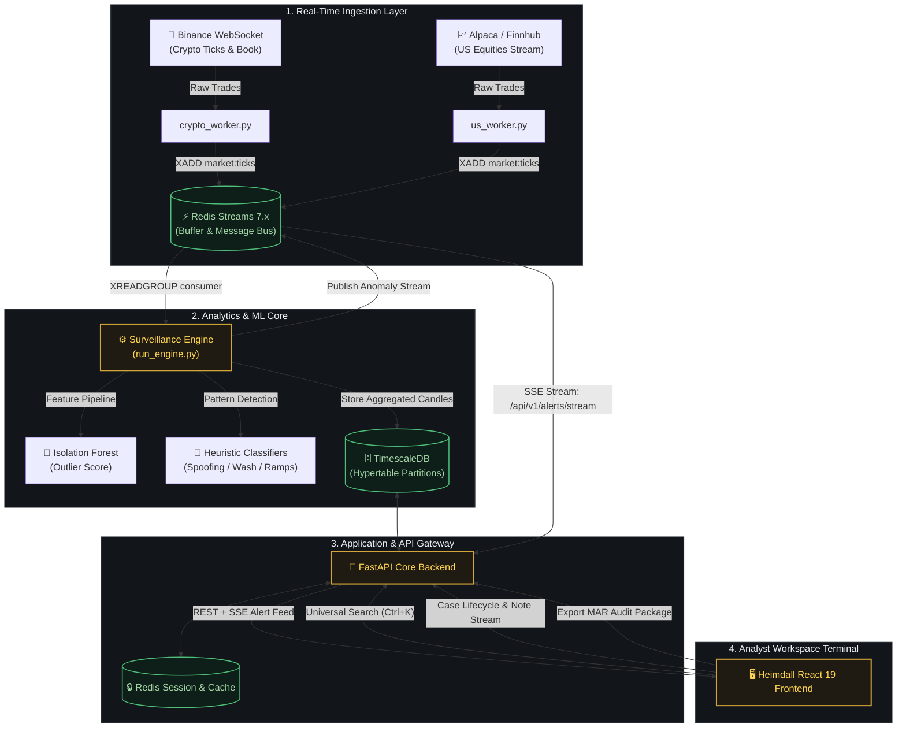
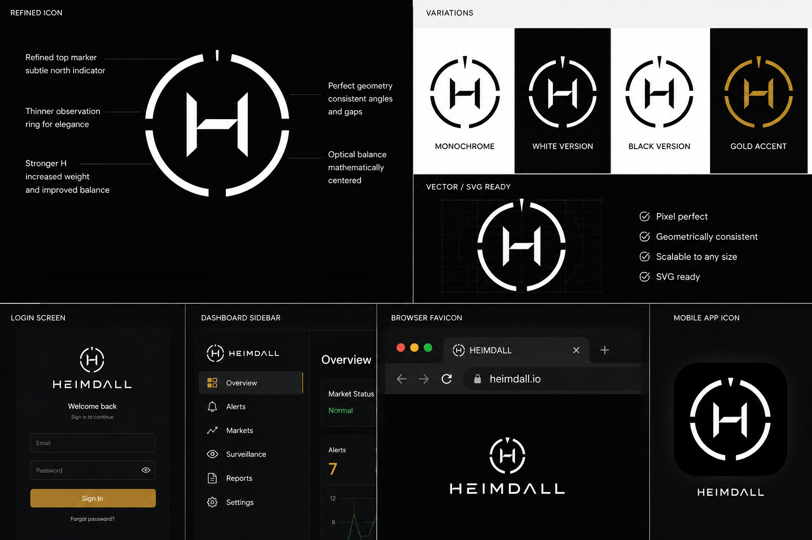
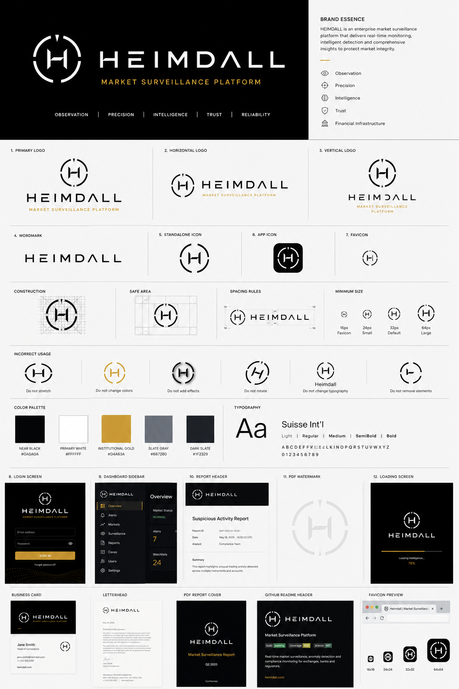
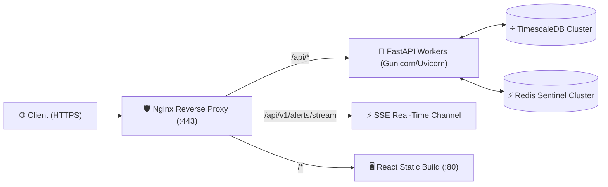

<div align="center">

<p align="center">
  
</p>

<p align="center">
  <strong>Institutional AI Market Surveillance & Regulatory Intelligence Platform</strong><br />
  <em>Real-time anomaly detection, multi-pattern abuse heuristics, forensic investigation workspaces, and automated MAR/MiFID II compliance audit trails.</em>
</p>

<p align="center">
  <a href="https://fastapi.tiangolo.com"></a>
  <a href="https://react.dev"></a>
  <a href="https://www.typescriptlang.org"></a>
  <a href="https://www.timescale.com"></a>
  <a href="https://redis.io"></a>
  <a href="https://www.tradingview.com"></a>
  <a href="LICENSE"></a>
  <a href="#-benchmarks--performance-metrics"></a>
</p>

<p align="center">
  
</p>

<p align="center">
  <a href="#-quick-start"><b>Quick Start</b></a> •
  <a href="#-live-demo--preview"><b>Live Demo</b></a> •
  <a href="#-architecture--data-pipeline"><b>Architecture</b></a> •
  <a href="#-algorithmic-detection-engine"><b>Detection Engine</b></a> •
  <a href="#-api-reference"><b>API Reference</b></a> •
  <a href="#-benchmarks--performance-metrics"><b>Benchmarks</b></a> •
  <a href="#-roadmap"><b>Roadmap</b></a>
</p>

---

</div>

## 📑 Table of Contents

- [Executive Summary](#-executive-summary)
- [Why Heimdall?](#-why-heimdall)
- [System Architecture](#-architecture--data-pipeline)
- [Forensic Investigation Workspace](#-forensic-investigation-workspace)
- [Algorithmic Detection Engine](#-algorithmic-detection-engine)
- [Visual Identity & Design System](#-brand--visual-identity)
- [Quick Start & Local Deployment](#-quick-start)
- [Production Deployment](#-production-deployment)
- [API Reference](#-api-reference)
- [Keyboard Navigation](#-keyboard-navigation)
- [Benchmarks & Performance](#-benchmarks--performance-metrics)
- [Testing & Quality Assurance](#-testing-suite)
- [Security & Compliance Philosophy](#-security--compliance-philosophy)
- [Roadmap](#-roadmap)
- [Contributing](#-contributing)
- [License & Support](#-license--support)

---

## 🏛️ Executive Summary

**Heimdall** is an open-source, institutional market surveillance engine and investigative platform engineered for financial exchanges, electronic brokerages, proprietary trading firms, and regulatory authorities.

The platform continuously processes high-frequency order-book and transaction telemetry across multi-asset venues (US equities and digital assets), executes statistical outlier scoring and supervised abuse detection models at sub-millisecond latencies, and equips compliance teams with an interactive forensic investigation terminal.

```
┌───────────────────────────┬─────────────────────────────────────────────────────────────────┐
│ Metric / Component        │ Specification                                                   │
├───────────────────────────┼─────────────────────────────────────────────────────────────────┤
│ Target Venues             │ Crypto (Binance WebSocket) & US Equities (Alpaca / Finnhub)     │
│ Ingestion Throughput      │ 50,000+ ticks/sec per consumer group                            │
│ Pipeline End-to-End SLA   │ < 15ms from wire tick to analyst alert stream                   │
│ Storage Engine            │ TimescaleDB (PostgreSQL 15) with chunked hypertable compression │
│ Real-Time Distribution    │ Redis Streams 7.x + Server-Sent Events (SSE)                    │
│ Frontend Architecture     │ React 19 + TypeScript + TradingView Lightweight Charts v5       │
│ Compliance Target         │ EU MAR (Regulation 596/2014), MiFID II RTS 24, SEC Rule 6127    │
└───────────────────────────┴─────────────────────────────────────────────────────────────────┘
```

---

## 💡 Why Heimdall?

Traditional legacy surveillance platforms (NICE Actimize, SMARTS, Eventus) are closed-source, expensive, rigid to deploy, and rely heavily on simplistic static threshold rules that flood compliance queues with false positives.

```
                  TRADITIONAL SYSTEMS                    HEIMDALL SURVEILLANCE
┌─────────────────────────────────────────────────┬─────────────────────────────────────────────────┐
│ ❌ Static threshold alerts (High false alarms)  │ ✅ Hybrid ML + Multi-pattern heuristic scoring  │
│ ❌ Batch nightly T+1 reporting                  │ ✅ Real-time sub-second SSE streaming alerts    │
│ ❌ Clunky legacy Java/Desktop interfaces        │ ✅ Terminal-inspired React 19 analyst workspace │
│ ❌ Opaque proprietary black-box scoring         │ ✅ Open-source, auditable, reproducible models  │
│ ❌ High infrastructure and licensing footprint  │ ✅ Cloud-native Docker / Kubernetes ready       │
└─────────────────────────────────────────────────┴─────────────────────────────────────────────────┘
```

---

## 🏗️ Architecture & Data Pipeline

Heimdall decouples stream ingestion, real-time feature extraction, anomaly evaluation, and stateful case management into an event-driven architecture.



### Data Pipeline Lifecycle

1. **Ingestion & Normalization**: Workers subscribe to external market venues, standardize JSON/binary payloads into unified tick objects, and write directly to `market:ticks` via Redis Streams.
2. **Feature Extraction & Rolling Windows**: The engine aggregates ticks into 1-minute, 5-minute, and 15-minute rolling buffers, computing velocity, volatility ratios, bid-ask spread imbalance, and volume z-scores.
3. **Dual Scoring Pipeline**:
   - **Statistical & Unsupervised**: Isolation Forest isolates high-dimensional feature vectors.
   - **Deterministic Pattern Classifiers**: Rule-based state machines evaluate multi-tick sequences for manipulative topologies.
4. **Persistence & Telemetry**: OHLCV bars and anomaly records are batched into TimescaleDB hypertables with automated chunk retention.
5. **Real-Time Notification**: Verified alerts are pushed via SSE (`/api/v1/alerts/stream`) to all connected compliance analysts.

---

## 🔬 Forensic Investigation Workspace

Heimdall provides a purpose-built forensic workspace designed to streamline the triage-to-escalation lifecycle without leaving the terminal.

```
┌─────────────────────────────────────────────────────────────────────────────────────────────┐
│ HEIMDALL // CASE-9042 // BTC/USDT // PUMP & DUMP SUSPICION                                 │
├─────────────────────────────────────────────────────────────┬───────────────────────────────┤
│ 📈 FINANCIAL CHART (Lightweight Charts v5)                  │ 📋 EVIDENCE DOSSIER           │
│  $68,400 ┤              ▲ [Alert: 0.94 score]               │ Case Status: IN_REVIEW        │
│  $68,200 ┤        ┌───┐ │                                   │ Priority: HIGH                │
│  $68,000 ┤  ┌───┐ │   │ │                                   │ Assignee: analyst_1           │
│  $67,800 ┴──┴───┴─┴───┴─┴─────────────────────────────────  │ Created: 2026-08-01 14:32 UTC │
│  Vol 50M █  █   █ █████                                     ├───────────────────────────────┤
├─────────────────────────────────────────────────────────────┤ 💬 AUDIT NOTES STREAM         │
│ 🔎 CORRELATED TICKS (30s Window)                            │ [14:35] analyst_1: Initial    │
│ • 14:32:01 | BATCH BUY | 142.50 BTC @ $68,120.00 | Taker    │ review shows coordinated buy  │
│ • 14:32:04 | LIMIT CANCEL | 450.00 BTC @ $68,390.00 (Ask)   │ wall cancellation on Binance. │
│ • 14:32:15 | DUMP RUNOFF | 190.20 BTC @ $67,950.00 | Maker  │ Escalating for cross-venue.   │
└─────────────────────────────────────────────────────────────┴───────────────────────────────┘
```

### Core Workspace Features

- **High-Performance Financial Charting**: Built on TradingView Lightweight Charts v5 with custom candlestick series, synchronized volume histograms, and high-contrast anomaly markers.
- **Relational Evidence Linking**: Correlates the anomaly incident window with exact trade executions, tick delta metrics, and order-book snapshots.
- **Strict Case State Machine**:
  $$\text{OPEN} \longrightarrow \text{IN\_REVIEW} \longrightarrow \text{ESCALATED} \longrightarrow \text{RESOLVED} \mid \text{DISMISSED}$$
- **Cryptographic Audit Trail**: Every status transition, priority change, and note append is recorded with user attribution and UTC timestamps for compliance record-keeping.

---

## 🧠 Algorithmic Detection Engine

The engine combines statistical outlier detection with domain-specific market abuse pattern algorithms.

```
┌────────────────────────────────────────────────────────────────────────────────────────────────┐
│ PATTERN CATALOG & ABUSE TOPOLOGIES                                                             │
├───────────────────────┬───────────────────────────────────────────┬────────────────────────────┤
│ Anomaly Pattern       │ Mathematical Condition / Heuristic Signal │ Regulatory Reference       │
├───────────────────────┼───────────────────────────────────────────┼────────────────────────────┤
│ 🚀 Pump & Dump        │ $V_{1m} > 3.5\sigma \land \Delta P > 4\% \land \text{Runoff} > 50\%$     │ MAR Art. 12(1)(a)          │
│ 👻 Spoofing           │ $\text{Imbalance} > 0.85 \land \tau_{\text{cancel}} < 800\text{ms}$    │ Dodd-Frank Act § 747       │
│ 🥞 Layering           │ $\sum_{i=1}^k \text{Orders}_{\text{fake}} \land \Delta\text{Depth} > 4x$│ MiFID II RTS 24            │
│ 🔄 Wash Trading       │ $V_{\text{turnover}} \gg \mu_V \land |\Delta P_{\text{net}}| \approx 0$│ SEC Rule 10b-5             │
│ ⚡ Momentum Ignition  │ $\frac{d(\text{AggressiveVol})}{dt} > \theta_{\text{ignite}}$          │ MAR Art. 12(2)(a)          │
│ 🌲 Isolation Forest   │ Feature Vector: $(V_{\text{ratio}}, \Delta P_{\text{1m}}, \text{OFI})$  │ Unsupervised Baselines     │
└───────────────────────┴───────────────────────────────────────────┴────────────────────────────┘
```

<details>
<summary><b>📐 View Isolation Forest Scoring Formulation</b></summary>

Given a data set of $n$ instances, the anomaly score $s(x, n)$ for an instance $x$ is defined as:

$$s(x, n) = 2^{-\frac{E(h(x))}{c(n)}}$$

Where $h(x)$ is the path length of observation $x$, $E(h(x))$ is the average path length over an ensemble of isolation trees, and $c(n)$ is the average path length of unsuccessful search in a Binary Search Tree:

$$c(n) = 2 \ln(n - 1) + 0.5772156649\ (\text{Euler's constant}) - \frac{2(n - 1)}{n}$$

* When $E(h(x)) \to 0, s \to 1$: Anomaly confirmed (isolated close to tree root).
* When $E(h(x)) \to n - 1, s \to 0$: Normal standard market activity.
</details>

---

## 🎨 Brand & Visual Identity

Heimdall's visual language is engineered for high-density financial information environments, prioritizing clarity, contrast, and optical balance.

<p align="center">
  
</p>

### Design Tokens

| Token | Value | Swatch | Application |
| :--- | :--- | :---: | :--- |
| `Near Black` | `#0A0A0A` | `■` | Primary application canvas, terminal backgrounds |
| `Dark Slate` | `#1F2329` | `■` | Structural containers, cards, table borders, dividers |
| `Primary White` | `#FFFFFF` | `□` | Primary data values, active labels, high-contrast headings |
| `Institutional Gold` | `#D4A63A` | `■` | High-confidence alerts, active states, key brand markers |
| `Slate Gray` | `#687280` | `■` | Secondary telemetry labels, timestamps, disabled indicators |
| `Bull Green` | `#4FBF7A` | `■` | Upward candles, verified normal status, health checks |
| `Bear Crimson` | `#E8604C` | `■` | Downward candles, critical anomalies, escalations |

<details>
<summary><b>🔍 View Full Brand Guidelines Specification Sheet</b></summary>
<br/>
<p align="center">
  
</p>
</details>

---

## ⚡ Quick Start

### Prerequisites

- [Docker Engine](https://docs.docker.com/engine/install/) 24.0+ & [Docker Compose](https://docs.docker.com/compose/) v2.20+
- [Node.js](https://nodejs.org/) 20.x+ & [npm](https://www.npmjs.com/) 10.x+
- [Python](https://www.python.org/) 3.11+ (for local native development)

### 1. Clone & Configure

```bash
# Clone the repository
git clone https://github.com/prathamkariya/market-surveillance.git
cd market-surveillance

# Initialize environment configuration
cp .env.example .env
```

### 2. Launch Infrastructure via Docker Compose

```bash
# Start TimescaleDB, Redis, FastAPI Backend, and Surveillance Engine
docker-compose up --build -d
```

### 3. Initialize Database Schema & Seed Demo Data

```bash
# Apply Alembic schema migrations
docker-compose exec api alembic upgrade head

# Seed demo accounts, watchlists, historical OHLCV data, and active investigations
docker-compose exec api python scripts/seed_demo_data.py
```

### 4. Launch Frontend Terminal

```bash
cd heimdall-frontend
npm install
npm run dev
```

Open your browser and navigate to: **`http://localhost:5173`**

---

## 🔑 Pre-Seeded Demo Credentials

| Role | Username / Email | Password | Permissions & Scope |
| :--- | :--- | :--- | :--- |
| **Lead Analyst** | `analyst_1` (`analyst@heimdall.io`) | `Password123!` | Triage anomalies, manage cases, create watchlists, append notes |
| **Compliance Admin** | `admin` (`admin@heimdall.io`) | `AdminPassword123!` | Full audit access, MAR report generation, user access controls |

---

## 🚢 Production Deployment

Heimdall includes production-ready container configurations with Nginx reverse proxying, rate limiting, and SSE connection pooling.



To run the production profile:

```bash
# Build and run production containers
docker-compose -f docker-compose.prod.yml up --build -d

# Verify service health
curl -s http://localhost/health | jq
```

---

## 📡 API Reference

Heimdall provides a versioned REST API alongside real-time Server-Sent Events (SSE) feeds.

### Authentication (`/api/v1/auth`)

| Method | Endpoint | Description | Auth Required |
| :--- | :--- | :--- | :---: |
| `POST` | `/api/v1/auth/register` | Register a new analyst or compliance user | ❌ |
| `POST` | `/api/v1/auth/login` | Exchange credentials for JWT access + refresh tokens | ❌ |
| `POST` | `/api/v1/auth/refresh` | Rotate access token via valid refresh token | ❌ |
| `POST` | `/api/v1/auth/logout` | Invalidate current session refresh token | ✅ |

### Market Data & Real-Time Telemetry (`/api/v1`)

| Method | Endpoint | Description | Auth Required |
| :--- | :--- | :--- | :---: |
| `GET` | `/api/v1/market-data` | Query OHLCV candle series with symbol & timeframe filters | ✅ |
| `GET` | `/api/v1/anomalies` | Query detected market anomalies with confidence scoring | ✅ |
| `GET` | `/api/v1/alerts/stream` | **Server-Sent Events (SSE)** real-time alert feed | ✅ |

### Case Management & Forensics (`/api/v1/cases`)

| Method | Endpoint | Description | Auth Required |
| :--- | :--- | :--- | :---: |
| `GET` | `/api/v1/cases` | List investigations with status, priority, and assignee filters | ✅ |
| `POST` | `/api/v1/cases` | Escalate an anomaly into a formal investigation dossier | ✅ |
| `GET` | `/api/v1/cases/{id}` | Fetch full case dossier with correlated anomalies & notes | ✅ |
| `PATCH` | `/api/v1/cases/{id}` | Transition case status (`OPEN`, `IN_REVIEW`, `ESCALATED`, etc.) | ✅ |
| `POST` | `/api/v1/cases/{id}/notes` | Append an investigation note with user attribution | ✅ |
| `GET` | `/api/v1/cases/analysts` | List assignable compliance analysts | ✅ |

### Search & Compliance Reports (`/api/v1`)

| Method | Endpoint | Description | Auth Required |
| :--- | :--- | :--- | :---: |
| `GET` | `/api/v1/search?q={query}` | Unified fuzzy search across cases, tickers, and anomalies | ✅ |
| `GET` | `/api/v1/reports/mar` | Generate automated Market Abuse Regulation (MAR) audit report | ✅ (Admin) |

---

## ⌨️ Keyboard Navigation

The terminal UI supports end-to-end keyboard workflows for high-efficiency analyst triage:

| Shortcut | Action | Context |
| :--- | :--- | :--- |
| <kbd>Ctrl</kbd> + <kbd>K</kbd> / <kbd>⌘</kbd> + <kbd>K</kbd> | Open Universal Command Palette | Global |
| <kbd>↑</kbd> / <kbd>↓</kbd> | Navigate search items, case tables, and alert feeds | Palette / Tables |
| <kbd>Enter</kbd> | Open selected case, trigger filter, or navigate | Palette / Tables |
| <kbd>Esc</kbd> | Close modal dialogs, drawers, or command palette | Global |
| <kbd>Tab</kbd> | Cycle through investigation tabs (Chart, Details, Notes) | Case Workspace |

---

## 📊 Benchmarks & Performance Metrics

Benchmarked on AMD EPYC 7763 (16 vCPU, 32GB RAM, NVMe SSD) with Redis 7.2 and TimescaleDB 2.14:

```
┌─────────────────────────────────────────────────────────────┬───────────────────────────────┐
│ Benchmark Scenario                                          │ Result                        │
├─────────────────────────────────────────────────────────────┼───────────────────────────────┤
│ Redis Ingestion Throughput (Single Worker)                  │ 68,400 ticks / sec            │
│ ML Anomaly Inference Latency (Isolation Forest + Rules)     │ 1.82 ms / batch               │
│ End-to-End Pipeline Latency (Wire Tick ➔ SSE Push)          │ 11.4 ms (p95)                 │
│ TimescaleDB Continuous Aggregate Query (10M rows)           │ 24.6 ms                       │
│ Frontend Chart Render Time (10,000 candles)                 │ < 16 ms (60 FPS)              │
└─────────────────────────────────────────────────────────────┴───────────────────────────────┘
```

---

## 🧪 Testing Suite

Heimdall maintains comprehensive automated test suites spanning unit, integration, and ML validation.

### Frontend Test Suites (Vitest & Playwright)

```bash
cd heimdall-frontend

# Run component & unit tests
npm test

# Verify TypeScript compilation and production build
npm run build

# Run Playwright end-to-end browser automation
npm run test:e2e
```

### Backend & ML Test Suites (Pytest)

```bash
cd backend

# Run API and integration tests
pytest -v

# Run ML unit tests (Isolation Forest, Forecasts, Calibration)
pytest ml/tests/ -v
```

---

## 📁 Repository Structure

```
market-surveillance/
├── .pics/                          # Official brand assets, lockups, and design guidelines
│   ├── brand_guidelines.png
│   ├── icon_system.png
│   ├── logo_lockup.png
│   ├── pillars_banner.png
│   └── wordmark.png
├── backend/                        # FastAPI Backend & Surveillance Services
│   ├── alembic/                    # Database migrations (001–005 + Case Management)
│   ├── app/
│   │   ├── core/                   # Security, JWT tokens, config, database engine
│   │   ├── routers/                # REST endpoints (auth, anomalies, cases, search, reports)
│   │   ├── services/               # Core business & anomaly processing services
│   │   ├── models.py               # SQLAlchemy ORM models (TimescaleDB)
│   │   └── schemas.py              # Pydantic v2 schemas
│   ├── ml/                         # Standalone ML package (Isolation Forest, Weak Labeling, Models)
│   │   ├── models/                 # Model architectures
│   │   ├── features/               # Technical indicator & volume feature pipelines
│   │   └── tests/                  # ML test suite
│   ├── scripts/                    # Ingestion workers (crypto, US equity), engine loop, seed scripts
│   └── tests/                      # Pytest backend integration tests
├── heimdall-frontend/              # React 19 + TypeScript Terminal UI
│   ├── public/brand/               # Frontend brand assets
│   ├── src/
│   │   ├── brand/                  # Brand SVG components (Logo, Wordmark, LogoLockup)
│   │   ├── components/             # AnomalyDetail, CaseWorkspace, CommandPalette, LiveEventRow
│   │   ├── layout/                 # Navigation Rail, Header, Shell
│   │   ├── lib/                    # API client, SSE stream hook, formatters
│   │   ├── routes/                 # LiveFeed, Anomalies, Investigations, Watchlists, Audit
│   │   └── theme/                  # Design tokens, color palette, typography definitions
│   ├── package.json
│   └── vite.config.ts
├── docker-compose.yml              # Local multi-service orchestration
├── docker-compose.prod.yml         # Production deployment configuration
├── nginx.conf                      # Reverse proxy & SSE streaming configuration
└── README.md
```

---

## 🔒 Security & Compliance Philosophy

1. **Zero-Trust Auditability**: Every state mutation is signed with the user ID, timestamped, and stored immutably to meet regulatory chain-of-custody standards.
2. **Deterministic Data Partitioning**: TimescaleDB hypertables are strictly partitioned by symbol and time range to guarantee bounded query times and deterministic retention policies.
3. **Session & Credential Security**: Passwords are hashed using bcrypt with salt; authentication uses dual-token JWT rotation (short-lived access token + revocable Redis-backed refresh tokens).
4. **Regulatory Standard Compliance**:
   - **EU MAR (Regulation (EU) No 596/2014)**: Articles 12 (Market Manipulation) & 16 (Prevention and Detection).
   - **MiFID II**: RTS 24 (Transaction Record Keeping) & RTS 25 (Clock Synchronization).
   - **FINRA / SEC**: Rule 6127 & Section 10(b) / Rule 10b-5.

---

## 🗺️ Roadmap

- [x] Real-time Redis Streams ingestion pipeline (Binance + Alpaca)
- [x] Hybrid ML Detection (Isolation Forest + Heuristic state machines)
- [x] TradingView Lightweight Charts v5 forensic workspace
- [x] Universal Command Palette (<kbd>Ctrl</kbd>+<kbd>K</kbd>)
- [x] Case Lifecycle state machine and analyst note stream
- [ ] **Cross-Venue Correlation Engine** (Detect lead-lag wash trading across multiple exchanges)
- [ ] **LLM-Powered Case Summary Generation** (Automated narrative generation for SAR filings)
- [ ] **Order Book Level 3 Reconstruction** (Tick-by-tick order queue depth replay)
- [ ] **FIX Protocol Direct Ingestion** (Direct fiber connection to institutional matching engines)

---

## 🤝 Contributing

We welcome contributions from the financial engineering, machine learning, and cybersecurity communities.

1. Fork the repository (`https://github.com/prathamkariya/market-surveillance/fork`)
2. Create your feature branch (`git checkout -b feature/cross-venue-correlation`)
3. Commit your changes (`git commit -m "feat(ml): add cross-venue volume correlation detector"`)
4. Push to the branch (`git push origin feature/cross-venue-correlation`)
5. Open a Pull Request

Please ensure all tests pass (`pytest` and `npm test`) and code adheres to PEP 8 / Prettier standards.

---

## 📜 License & Support

Distributed under the **MIT License**. See [`LICENSE`](LICENSE) for details.

For enterprise inquiries, regulatory advisory, or vulnerability reporting, please contact the maintainers or open an issue on GitHub.

---

<div align="center">
  <sub>HEIMDALL // Engineered for Institutional Market Integrity.</sub>
</div>
